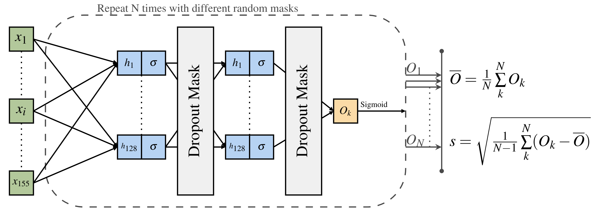

[](https://github.com/tjiagoM/adni_phenotypes/blob/master/LICENSE)
[](https://doi.org/10.1038/s43856-023-00313-w)

#  Identifying healthy individuals with Alzheimer’s disease neuroimaging phenotypes in the UK Biobank 

*Tiago Azevedo, Richard A.I. Bethlehem, David J. Whiteside, Nol Swaddiwudhipong, James B. Rowe, Pietro Lió, Timothy Rittman*




This repository contains all the code necessary to run and further extend the experiments presented in [our paper at Communications Medicine]([https://doi.org/10.1101/2022.01.05.22268795](https://www.nature.com/articles/s43856-023-00313-w)). If you use our work in your research please cite our paper with the following bibtex:

```
@article{Azevedo2023,
  doi = {10.1038/s43856-023-00313-w},
  url = {https://doi.org/10.1038/s43856-023-00313-w},
  year = {2023},
  month = jul,
  publisher = {Springer Science and Business Media {LLC}},
  volume = {3},
  number = {1},
  author = {Tiago Azevedo and Richard A.I. Bethlehem and David J. Whiteside and Nol Swaddiwudhipong and James B. Rowe and Pietro Li{\'{o}} and Timothy Rittman},
  title = {Identifying healthy individuals with Alzheimer's disease neuroimaging phenotypes in the {UK} Biobank},
  journal = {Communications Medicine}
}
```

If something is not clear or you have any question please [open an issue](https://github.com/tjiagoM/adni_phenotypes/issues).

# Data availability

Unfortunately, we are not allowed to publicly release the data used from ADNI, NACC, and the UK Biobank. However, explanations about each file used by us can be seen in the code, which in turn will be explained in the remaining of this repository. 

The code to preprocess all datasets can also be accessed in this folder in the Jupyter notebooks (`*.ipynb` files).

We hope that this could be enough to show how we used and preprocessed the different datasets, in case you download the data by yourself. If it is not, please feel free to [open an issue](https://github.com/tjiagoM/adni_phenotypes/issues) and we will try to help the best we can.


# Machine learning model train and inference

## Python dependencies

The machine learning model was developed using Python, whose dependencies are contained in the file `adni_env.yml`. To install all the dependencies automatically with [Miniconda](https://docs.conda.io/en/latest/miniconda.html) or [Anaconda](https://anaconda.org/), one can easily just run the following command in the terminal to create an Anaconda environment:

```bash
$ conda env create -f adni_env.yml
$ conda activate adni_env
```

## Running the experiments

The code in this repository relies on [Weights & Biases](https://www.wandb.com/) to keep track and organise the results of experiments. We recommend that a user wanting to run and extend our code first gets familiar with the [online documentation](https://docs.wandb.com/). The main run used in the paper can be seen here: https://wandb.ai/tjiagom/adni_phenotypes/runs/2cxy59fk

The training script used in the paper is in `train.py`, with all hyperparameters hard-coded inside, the model's architecture defined in `models.py`, and data loader in `datasets.py`.

To run inference on the trained model, we used the script `inference.py`, which saves the output in the `results/` folder (given stochasticity, we provide all our outputs in this folder for reproducibility). Different flags are available; for example, the following script:

```bash
$ python inference.py --dataset_location data/adni_test_scaled_corrected.csv --dataset_id adni
```

will run infrence on the test set of the ADNI dataset using Monte Carlo dropout as described in the paper. In this case, the output of the model will be stored in `results/latest_output_adni_50.csv`.


## Remaining repository structure for ML model
- `model_statistics.py`: contains the code used to calculate averaged times to run our models as reported in the paper.
- `regress_models/`: This folder contain pickle files with the regression models used in the ADNI train set, which are needed to preprocess the ADNI test set, and the NACC/UKB datasets. The way these files are created and used can be seen in `data/Preprocessing ADNI data.ipynb`.
- `results/`: besides logging the `.csv` data files as previously explained, it also contains several Jupyter Notebooks (`*.ipynb` files) with various analysis explored in the paper.
- `saved_models/`: it contains the single pytorch model used in the paper; however, this file is overwritten every time `inference.py` is run


# Bayesian Statistical Analysis

Folders corresponding to this part are:
- `adni_clinicalscores/`
- `demographics/`
- `nacc_clinicalscores/`
- `ukbb_clinicalscores/`
- `adni_phenotypes.Rproj`


